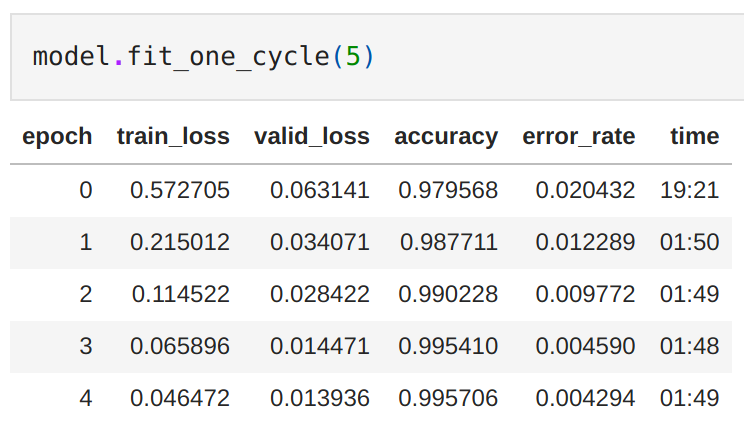
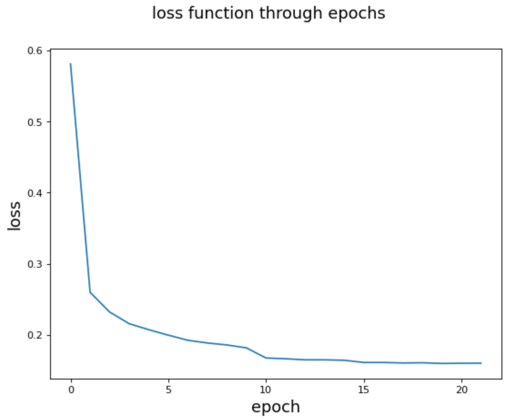
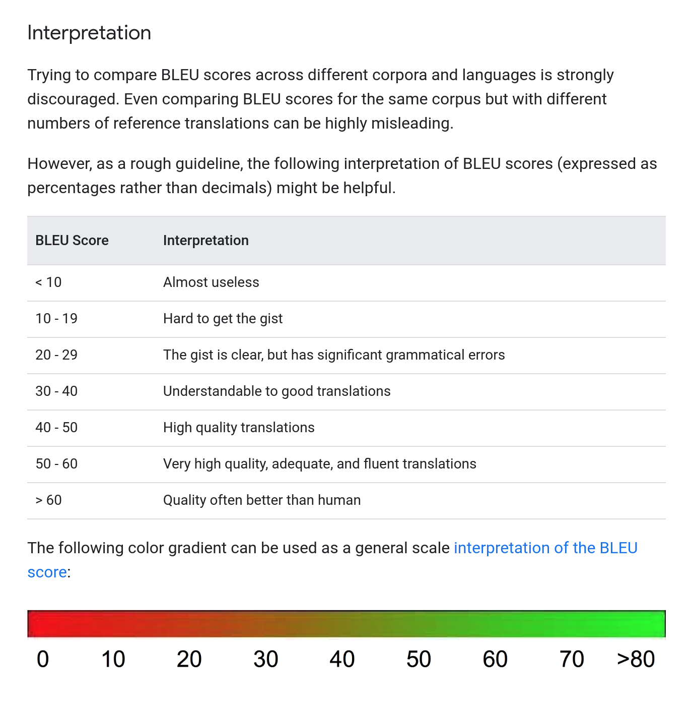

# Attention Mechanisms for Visual Question Answering

project for the Computer Science subject `Text Mining`, `2021 FAMAF UNC`

Author: `Guido  Ivetta`

Prof: `Laura Alonso Alemany`

# Introduction

The goal of this project is to build a multimodal (vision and NLP) model to detect plants and their diseases by analyzing photographs.


The expected output is a text string like:

* `This is an unhealthy PLANTNAME leaf with X disease.`
* `This PLANTNAME is perfectly healthy.`
* etc.

I have made a short [YouTube video](https://www.youtube.com/watch?v=PSrvPiCu0Y4&ab_channel=GuidoIvetta) in Spanish explaining the process of making this project, and live-running the different models created for the task.

# Dataset

A reduced version of the [PlantVillage dataset](https://www.kaggle.com/emmarex/plantdisease) was used for training. It was chosen because it provides labels for images of plant leaves in categories of the format `PLANTNAME__DISEASENAME`.

This dataset contains an open access repository of images on plant health to enable the development of mobile disease diagnostics. The dataset contains 54, 309 images. The images span 14 crop species: `Apple`, `Blueberry`, `Cherry`, `Grape`, `Orange`, `Peach`, `Bell Pepper`, `Potato`, `Raspberry`, `Soybean`, `Squash`, `Strawberry`, and `Tomato`. It contains images of 17 fungal diseases, 4 bacterial diseases, 2 molds (oomycete) diseases, 2 viral diseases, and 1 disease caused by a mite. 12 crop species also have images of healthy leaves that are not visibly affected by a disease.

# Approaches

This repository provides two approaches to reaching this project's goal:

* Image classification with [fastai](https://www.fast.ai/) based on [this post](https://towardsdatascience.com/plant-disease-detection-web-application-using-fastai-b0c389b82371).
* A PyTorch implementation of [Show and Tell: A Neural Image Caption Generator](https://arxiv.org/pdf/1411.4555.pdf) and [Show, Attend and Tell: Neural Image Caption Generation with Visual Attention](https://arxiv.org/pdf/1502.03044.pdf) based on [this repository](https://github.com/tangbinh/image-captioning).

# The `fastai` approach

(See `fastai_image_classificator.ipynb` for code details)

This approach is a classification approach, not a language generation one. It will try to classify images in one of the target classes, namely any possible combination of PLANTNAME__DISEASENAME. It  applies a Transfer Learning approach described from the fastai docs as:

* Transfer learning is a technique where you use a model trained on a very large dataset (usually ImageNet in computer vision) and then adapt it to your own dataset. The idea is that it has learned to recognize many features on all of this data, and that you will benefit from this knowledge, especially if your dataset is small, compared to starting from a randomly initialized model. It has been proved in this article on a wide range of tasks that transfer learning nearly always give better results.

  In practice, you need to change the last part of your model to be adapted to your own number of classes. Most convolutional models end with a few linear layers (a part we will call the head). The last convolutional layer will have analyzed features in the image that went through the model, and the job of the head is to convert those in predictions for each of our classes. In transfer learning we will keep all the convolutional layers (called the body or the backbone of the model) with their weights pretrained on ImageNet but will define a new head initialized randomly.

  Then we will train the model we obtain in two phases: first we freeze the body weights and only train the head (to convert those analyzed features into predictions for our own data), then we unfreeze the layers of the backbone (gradually if necessary) and fine-tune the whole model (possibly using differential learning rates).

  The cnn_learner factory method helps you to automatically get a pretrained model from a given architecture with a custom head that is suitable for your data.

The [Resnet34](https://models.roboflow.com/classification/resnet34) pre-trained model was used here as basis.

## Training

To create the transfer learning model we will need to use the function cnn_learner that takes the training data for the target domain, the basis network trained in the source domain, and the metrics. The metrics are just used to print out how the training is performing.


```python
model = cnn_learner(img_data, models.resnet34, metrics=[accuracy, error_rate])
```

We will train for 5 epochs:



As we can see above by just running five epochs with the default setting our accuracy for this fine-grained classification task is around ~99.57%.

We can also plot the confusion matrix:


We can see that the model has very few errors, with most of the classification in the diagonal of the confusion matrix.

The model at work:

```python
with open(path, "rb") as image:
  img_bytes = image.read()
  img = open_image(BytesIO(img_bytes))
  prediction = learn.predict(img)[0]
  print(prediction)
------------------------------
output: "Pepper__bell___healthy"
```

# The `PyTorch` approach

This is a language generation approach, more concretely, we aim to generate a caption that describes a given image. (See [this repository](https://github.com/tangbinh/image-captioning) for code details)

## Getting annotations

The most labor-intensive part of this approach was building the correct natural language [COCO style annotations](https://www.immersivelimit.com/tutorials/create-coco-annotations-from-scratch) from the classification labels found in the PlantVillage Dataset.


First we split between `train`, `val`, and `test` datasets with 80%, 10%, and 10% of the dataset respectively:

```python
import splitfolders
splitfolders.ratio("PlantVillage", output="PlantVillageDivided", seed=1337, ratio=(.8, .1, .1), group_prefix=None)
```

Then, we get all the images filenames for each category:

```python
import glob
import os
categories = ["train", "val", "test"]
for category in categories:
  subdirs = [os.path.basename(x) for x in glob.glob(f"./{category}/*")]
  for subdir in subdirs:
    file_names = [os.path.basename(x) for x in glob.glob(f"./{category}/{subdir}/*")]
    with open(f'./{category}/{subdir}.txt', 'w') as f:
      for file_name in file_names:
        f.write(file_name)
        f.write('\n')
```

Finally, we build the `COCO style annotations` by creating a JSON with the images data first, and annotations data second:

```python
import glob
# All files ending with .txt
data_files_paths = glob.glob("./*.txt")

diseaseNameOrder = []
diseaseNameIdEnd = [0]


print("{\n\"images\": [\n")
i=0
for data_file_path in data_files_paths:
  with open(data_file_path) as file:
    lines = file.readlines()
    lines = [line.rstrip() for line in lines]

  for image_path in lines:
    image_item = "{\n"f'  "file_name": "{image_path}",\n'+f'  "height": 256,\n  "width": 256,\n'f'  "id": {i}\n'"},"
    print(image_item)
    i+=1
  diseaseNameOrder.append(data_file_path)
  diseaseNameIdEnd.append(i)
print("],")

print("\"annotations\": [\n")
i=0
for j in range(len(diseaseNameIdEnd)-1):
  (plant_name, _, diseaseName) = diseaseNameOrder[j][len('./'):][:-len('.txt')].partition("__")
  diseaseName = diseaseName.replace("_", " ")
  for image_id in range(diseaseNameIdEnd[j],diseaseNameIdEnd[j+1]):
    sampleDescriptions = []
    if(diseaseName == "healthy"):
      sampleDescriptions.append(f"Un {plant_name} saludable.")
      sampleDescriptions.append(f"Una hoja de {plant_name} en buena salud.")
      sampleDescriptions.append(f"Una hoja de {plant_name} en buenas condiciones.")
      sampleDescriptions.append(f"Una saludable hoja de {plant_name}.")
      sampleDescriptions.append(f"Una hoja de {plant_name} sin enfermedades.")
      sampleDescriptions.append(f"Una hoja de {plant_name} perfectamente saludable.")
    else:
      sampleDescriptions.append(f"Una hoja de {plant_name} con {diseaseName}.")
      sampleDescriptions.append(f"Una hoja de {plant_name} en malas condiciones, tiene {diseaseName}.")
      sampleDescriptions.append(f"Una hoja de {plant_name} en mala salud, tiene {diseaseName}.")
      sampleDescriptions.append(f"Un {plant_name} enfermo con {diseaseName}")
    for description in sampleDescriptions:
      annotation_item = "{\n"f'  "image_id": {image_id},\n'+f'  "id": {i},\n'f'  "caption": "{description}"\n'"},"
      print(annotation_item)
      i+=1
print("]\n}")
```

# Preprocessing

Using the newly created annotations, we can run the `preprocess.py` script with:

```
python preprocess.py --data DATA_DIR --dest-dir DEST_DIR
```

# Training

Using the features we just generated, it's time to finally train our model with:

```
python train.py --arch show_attend_tell --data DEST_DIR --save-dir checkpoints_esp/show_attend_tell --log-file logs/show_attend_tell.log
```

We will train for 21 epochs:

```
Epoch 000: loss 0.5808 | lr 0.0002 | num_tokens 10.27 | batch_size 9.993 | grad_norm 2.038 | clip 0.0279
Epoch 000: valid_loss 0.2703 | num_tokens 10.27 | batch_size 9.993
Epoch 001: loss 0.2599 | lr 0.0002 | num_tokens 10.27 | batch_size 9.993 | grad_norm 1.861 | clip 0.01004
Epoch 001: valid_loss 0.2339 | num_tokens 10.27 | batch_size 9.993
Epoch 002: loss 0.2321 | lr 0.0002 | num_tokens 10.27 | batch_size 9.993 | grad_norm 1.838 | clip 0.001116
Epoch 002: valid_loss 0.2247 | num_tokens 10.27 | batch_size 9.993
Epoch 003: loss 0.2157 | lr 0.0002 | num_tokens 10.27 | batch_size 9.993 | grad_norm 1.797 | clip 0.003348
Epoch 003: valid_loss 0.2137 | num_tokens 10.27 | batch_size 9.993
Epoch 004: loss 0.2073 | lr 0.0002 | num_tokens 10.27 | batch_size 9.993 | grad_norm 1.786 | clip 0.001116
Epoch 004: valid_loss 0.2155 | num_tokens 10.27 | batch_size 9.993
Epoch 005: loss 0.1996 | lr 0.0002 | num_tokens 10.27 | batch_size 9.993 | grad_norm 1.755 | clip 0.004464
Epoch 005: valid_loss 0.2107 | num_tokens 10.27 | batch_size 9.993
Epoch 006: loss 0.1924 | lr 0.0002 | num_tokens 10.27 | batch_size 9.993 | grad_norm 1.729 | clip 0.002232
Epoch 006: valid_loss 0.2139 | num_tokens 10.27 | batch_size 9.993
Epoch 007: loss 0.1886 | lr 0.0002 | num_tokens 10.27 | batch_size 9.993 | grad_norm 1.721 | clip 0.001116
Epoch 007: valid_loss 0.2121 | num_tokens 10.27 | batch_size 9.993
Epoch 008: loss 0.1858 | lr 0.0002 | num_tokens 10.27 | batch_size 9.993 | grad_norm 1.7 | clip 0.001116
Epoch 008: valid_loss 0.2154 | num_tokens 10.27 | batch_size 9.993
Epoch 009: loss 0.1817 | lr 0.0002 | num_tokens 10.27 | batch_size 9.993 | grad_norm 1.672 | clip 0.002232
Epoch 009: valid_loss 0.2193 | num_tokens 10.27 | batch_size 9.993
Epoch 010: loss 0.1675 | lr 4e-05 | num_tokens 10.27 | batch_size 9.993 | grad_norm 1.548 | clip 0
Epoch 010: valid_loss 0.2021 | num_tokens 10.27 | batch_size 9.993
Epoch 011: loss 0.1664 | lr 4e-05 | num_tokens 10.27 | batch_size 9.993 | grad_norm 1.546 | clip 0
Epoch 011: valid_loss 0.2036 | num_tokens 10.27 | batch_size 9.993
Epoch 012: loss 0.1649 | lr 4e-05 | num_tokens 10.27 | batch_size 9.993 | grad_norm 1.536 | clip 0
Epoch 012: valid_loss 0.2044 | num_tokens 10.27 | batch_size 9.993
Epoch 013: loss 0.1649 | lr 4e-05 | num_tokens 10.27 | batch_size 9.993 | grad_norm 1.553 | clip 0
Epoch 013: valid_loss 0.2062 | num_tokens 10.27 | batch_size 9.993
Epoch 014: loss 0.1643 | lr 4e-05 | num_tokens 10.27 | batch_size 9.993 | grad_norm 1.554 | clip 0
Epoch 014: valid_loss 0.2057 | num_tokens 10.27 | batch_size 9.993
Epoch 015: loss 0.1612 | lr 8e-06 | num_tokens 10.27 | batch_size 9.993 | grad_norm 1.52 | clip 0
Epoch 015: valid_loss 0.2055 | num_tokens 10.27 | batch_size 9.993
Epoch 016: loss 0.1612 | lr 8e-06 | num_tokens 10.27 | batch_size 9.993 | grad_norm 1.528 | clip 0
Epoch 016: valid_loss 0.2073 | num_tokens 10.27 | batch_size 9.993
Epoch 017: loss 0.1605 | lr 8e-06 | num_tokens 10.27 | batch_size 9.993 | grad_norm 1.524 | clip 0
Epoch 017: valid_loss 0.2058 | num_tokens 10.27 | batch_size 9.993
Epoch 018: loss 0.1608 | lr 8e-06 | num_tokens 10.27 | batch_size 9.993 | grad_norm 1.53 | clip 0
Epoch 018: valid_loss 0.2055 | num_tokens 10.27 | batch_size 9.993
Epoch 019: loss 0.1598 | lr 1.6e-06 | num_tokens 10.27 | batch_size 9.993 | grad_norm 1.526 | clip 0
Epoch 019: valid_loss 0.2054 | num_tokens 10.27 | batch_size 9.993
Epoch 020: loss 0.1601 | lr 1.6e-06 | num_tokens 10.27 | batch_size 9.993 | grad_norm 1.52 | clip 0
Epoch 020: valid_loss 0.2054 | num_tokens 10.27 | batch_size 9.993
Epoch 021: loss 0.1602 | lr 1.6e-06 | num_tokens 10.27 | batch_size 9.993 | grad_norm 1.522 | clip 0
Epoch 021: valid_loss 0.2057 | num_tokens 10.27 | batch_size 9.993
```

Graphing the evolution of the loss function:



## Getting captions

Two scripts are provided to get captions from images: 

* `getCaptionsForOneImage.py`: generates a side-by-side comparison of three nouns in the caption with their respective attention:


  To use it, run:
  ```
  python getCaptionsForOneImage.py --checkpoint-path /content/drive/MyDrive/bla_copia/checkpoints_esp/show_attend_tell/checkpoint_best.pt --images-path /content/drive/MyDrive/bla_copia/IMAGES_TO_CAPTION/image
  ```

* `getTextCaptionsForMultipleImages.py`: generates text captions for all images in a directory and stores them in a `.txt` file.


  To use it, run:

  ```
  python getTextCaptionsForMultipleImages.py --checkpoint-path /content/drive/MyDrive/bla_copia/checkpoints_esp/show_attend_tell/checkpoint_best.pt --images-path /content/drive/MyDrive/bla_copia/IMAGES_TO_CAPTION/image
  ```

## BLEU score

Usually the BLEU score is used for evaluating the accuracy of machine-translation models, but also more generally for open-ended natural language tasks. We have used it here as a general, not precise, indicator of performance.

The score was calculated for 4 different n-grams:

```
BLEU_unigram = 50.5088

BLEU_bigram = 42.3733

BLEU_3-gram = 36.6993

BLEU_4-gram = 31.5989
```

Interpretation of BLEU:



Thus, the BLEU scores we obtained indicate that we are obtaining understandable to high-quality results at every level.

This results are consistent with our record low `0.1598` of the loss function.
